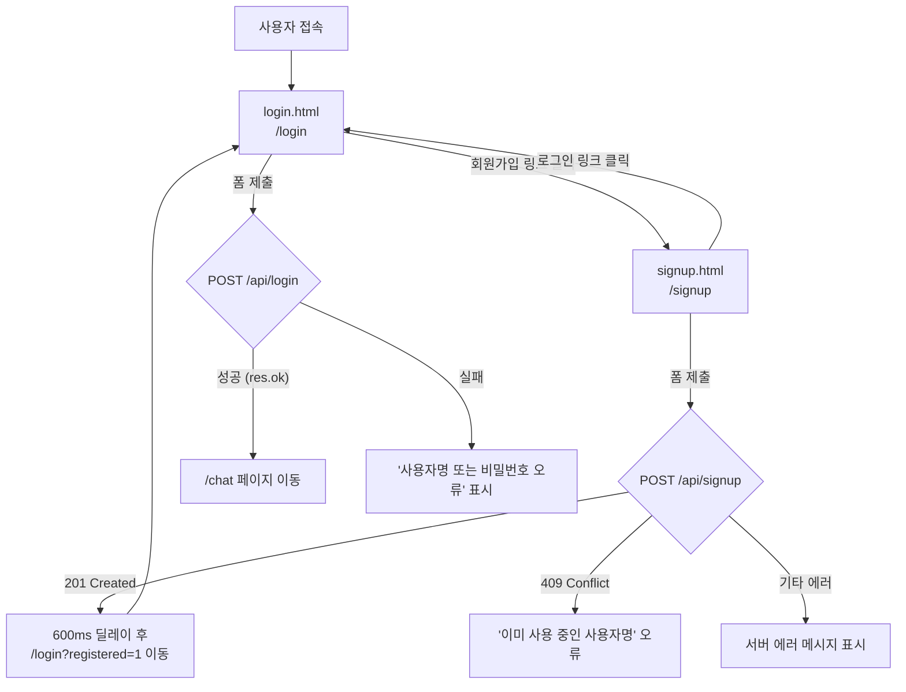

# 로그인 / 회원가입 프론트엔드 파일 상세 개요

> AskMate 서비스의 인증(Authentication) UI를 구성하는 4개 파일에 대한 상세 문서입니다.

---

## 목차

1. [파일 구조 요약](#파일-구조-요약)
2. [login.html — 로그인 템플릿](#1-loginhtml--로그인-템플릿)
3. [login.js — 로그인 스크립트](#2-loginjs--로그인-스크립트)
4. [signup.html — 회원가입 템플릿](#3-signuphtml--회원가입-템플릿)
5. [signup.js — 회원가입 스크립트](#4-signupjs--회원가입-스크립트)
6. [페이지 간 흐름 다이어그램](#페이지-간-흐름-다이어그램)
7. [공통 의존성](#공통-의존성)

---

## 파일 구조 요약

| 파일 경로 | 역할 | 줄 수 |
|---|---|---|
| `backend/app/templates/login.html` | 로그인 페이지 Jinja2 HTML 템플릿 | 66 |
| `backend/app/static/js/login.js` | 로그인 폼 제출 · API 호출 · 오류 처리 | 64 |
| `backend/app/templates/signup.html` | 회원가입 페이지 Jinja2 HTML 템플릿 | 85 |
| `backend/app/static/js/signup.js` | 회원가입 폼 제출 · 클라이언트 검증 · API 호출 | 109 |

---

## 1. login.html — 로그인 템플릿

**경로**: `backend/app/templates/login.html`

### 개요

Jinja2 템플릿으로, `base.html`을 상속(``)합니다. 로그인에 필요한 최소 UI(아이디, 비밀번호)를 제공합니다.

### 블록 구성

| 블록 | 내용 |
|---|---|
| `` | 페이지 타이틀: **로그인** |
| `` | 로그인 폼 UI 전체 |
| `` | `login.js`를 `defer`로 로드 |

### 주요 DOM 요소

| ID / 클래스 | 태그 | 설명 |
|---|---|---|
| `loginAlert` | `<div class="alert">` | 성공/오류 메시지 표시 영역 (기본 `display:none`) |
| `loginForm` | `<form>` | 로그인 폼. `novalidate` 속성으로 브라우저 기본 검증 비활성화 |
| `loginUsername` | `<input type="text">` | 아이디 입력. `autocomplete="username"`, `autofocus` |
| `loginPassword` | `<input type="password">` | 비밀번호 입력. `autocomplete="current-password"` |
| `.toggle-password` | `<button>` | 비밀번호 표시/숨김 토글 (👁️). `data-target="loginPassword"` |
| `loginSubmitBtn` | `<button type="submit">` | 제출 버튼. 내부에 `.btn-text`와 `.btn-spinner` 자식 요소 |

### 네비게이션 링크

- **회원가입**: `{{ url_for('signup_page') }}` — 하단 `auth-footer` 영역에 위치

---

## 2. login.js — 로그인 스크립트

**경로**: `backend/app/static/js/login.js`

### 개요

`DOMContentLoaded` 이벤트 기반으로 동작하며, `loginForm`의 `submit` 이벤트를 가로채 `POST /api/login`을 비동기 호출합니다.

### 주요 로직 흐름

```
1. DOM 로드 완료
2. URL 파라미터 ?registered=1 감지 → 회원가입 완료 안내 메시지 표시
3. 폼 submit 이벤트 발생
   3-1. 아이디/비밀번호 빈값 검사 → 실패 시 오류 alert 표시
   3-2. 버튼 비활성화 + 스피너 표시
   3-3. apiRequest("/api/login", { method: "POST", body: { username, password } })
   3-4-A. 성공(res.ok) → window.location.assign("/chat") 으로 채팅 페이지 이동
   3-4-B. 실패 → 오류 메시지 표시, 비밀번호 필드 초기화 및 포커스
```

### 세부 동작

| 항목 | 설명 |
|---|---|
| **빈값 검사** | `username.trim()`이 빈 문자열이거나 `password`가 빈 문자열이면 폼 제출 차단 |
| **비밀번호 전송** | `trim()` 없이 원본 그대로 전송 (docs/API.md 참조) |
| **회원가입 완료 안내** | URL에 `?registered=1` 쿼리 파라미터가 있으면 `alert-success` 클래스로 안내 메시지 표시 |
| **스피너 UX** | 제출 시 버튼 내 `.btn-text` 숨기고 `.btn-spinner` 표시. 실패 시 원복 |
| **오류 메시지** | `getErrorMessage(res.data, "사용자명 또는 비밀번호가 올바르지 않습니다.")` — 서버 응답 메시지 또는 기본 폴백 |
| **로그인 성공 후 이동** | `/chat` 페이지로 이동 |

### 외부 의존 함수

- `apiRequest()` — HTTP 요청 래퍼 (공통 유틸리티)
- `getErrorMessage()` — 서버 응답에서 에러 메시지 추출 (공통 유틸리티)

---

## 3. signup.html — 회원가입 템플릿

**경로**: `backend/app/templates/signup.html`

### 개요

`base.html`을 상속하며, 아이디·비밀번호·비밀번호 확인 3개 필드로 구성된 회원가입 폼을 제공합니다.

### 블록 구성

| 블록 | 내용 |
|---|---|
| `` | 페이지 타이틀: **회원가입** |
| `` | 회원가입 폼 UI 전체 |
| `` | `signup.js`를 `defer`로 로드 |

### 주요 DOM 요소

| ID / 클래스 | 태그 | 설명 |
|---|---|---|
| `signupAlert` | `<div class="alert">` | 성공/오류 메시지 표시 영역 (기본 `display:none`) |
| `signupForm` | `<form>` | 회원가입 폼. `novalidate` 속성 |
| `signupUsername` | `<input type="text">` | 아이디 입력. placeholder에 규칙 안내 포함 |
| `signupPassword` | `<input type="password">` | 비밀번호 입력. `autocomplete="new-password"` |
| `signupPasswordConfirm` | `<input type="password">` | 비밀번호 확인 입력 |
| `passwordMatchHint` | `<span class="form-hint">` | 비밀번호 실시간 일치 여부 힌트 영역 |
| `.toggle-password` (×2) | `<button>` | 비밀번호/비밀번호 확인 각각에 표시/숨김 토글 |
| `signupSubmitBtn` | `<button type="submit">` | 제출 버튼. `.btn-text` + `.btn-spinner` 구조 |

### 입력 필드 안내 문구 (form-hint)

- **아이디**: "영문, 숫자, 밑줄(_)만 가능하며 3자 이상 30자 이하로 입력해 주세요."
- **비밀번호**: "안전한 사용을 위해 15자 이상 128자 이하로 입력해 주세요. (공백 및 유니코드 가능)"

### 네비게이션 링크

- **로그인**: `{{ url_for('login_page') }}` — 하단 `auth-footer` 영역에 위치

---

## 4. signup.js — 회원가입 스크립트

**경로**: `backend/app/static/js/signup.js`

### 개요

`DOMContentLoaded` 이벤트 기반으로 동작합니다. 클라이언트 사이드 유효성 검사를 수행한 뒤 `POST /api/signup`을 비동기 호출합니다.

### 주요 로직 흐름

```
1. DOM 로드 완료
2. 비밀번호 / 비밀번호 확인 필드에 input 이벤트 리스너 등록 (실시간 일치 검증)
3. 폼 submit 이벤트 발생
   3-1. 아이디 유효성 검사 (정규식: /^[a-zA-Z0-9_]{3,30}$/) → 실패 시 오류 표시
   3-2. 비밀번호 길이 검사 (15 ≤ length ≤ 128) → 실패 시 오류 표시
   3-3. 비밀번호 일치 검사 (password === passwordConfirm) → 실패 시 오류 표시
   3-4. 버튼 비활성화 + 스피너 표시
   3-5. apiRequest("/api/signup", { method: "POST", body: { username, password } })
   3-6-A. 성공(201) → 안내 메시지 → 600ms 후 /login?registered=1 으로 리다이렉트
   3-6-B. 실패(409) → "이미 사용 중인 사용자명" 오류 표시
   3-6-C. 기타 실패 → getErrorMessage()로 오류 표시
```

### 클라이언트 검증 규칙

| 항목 | 규칙 | 오류 메시지 |
|---|---|---|
| 아이디 형식 | `/^[a-zA-Z0-9_]{3,30}$/` | "아이디는 3~30자의 영문, 숫자, 밑줄(_)만 사용할 수 있습니다." |
| 비밀번호 길이 | 15자 이상, 128자 이하 | "비밀번호는 15자 이상 128자 이하로 입력해 주세요." |
| 비밀번호 일치 | `password === passwordConfirm` | "비밀번호와 비밀번호 확인 입력값이 일치하지 않습니다." |

### 실시간 비밀번호 일치 힌트

`checkPasswordMatch()` 함수가 비밀번호·비밀번호 확인 양쪽 input 이벤트에 바인딩되어 실시간으로 일치 여부를 표시합니다.

| 상태 | 표시 텍스트 | CSS 클래스 |
|---|---|---|
| 확인 필드 비어 있음 | (빈 문자열) | `form-hint` |
| 일치 | "✓ 비밀번호가 일치합니다." | `form-hint hint-success` |
| 불일치 | "✗ 비밀번호가 일치하지 않습니다." | `form-hint hint-error` |

### 특이 사항

- **아이디 소문자 변환**: `rawUsername.toLowerCase()`로 대소문자를 통일하여 전송 (docs/FRONTEND.md 참조)
- **비밀번호는 trim() 금지**: 공백 포함 원본 그대로 전송
- **API 요청 시 `password_confirm` 미전송**: 서버에는 `username`과 `password`만 전송
- **성공 후 자동 로그인 안 함**: 로그인 페이지(`/login?registered=1`)로 리다이렉트
- **HTTP 409 전용 처리**: 사용자명 중복 시 별도 메시지 표시

### 외부 의존 함수

- `apiRequest()` — HTTP 요청 래퍼 (공통 유틸리티)
- `getErrorMessage()` — 서버 응답에서 에러 메시지 추출 (공통 유틸리티)

---

## 페이지 간 흐름 다이어그램



---

## 공통 의존성

### 상속 템플릿

- **`base.html`**: 두 HTML 템플릿 모두 ``로 공통 레이아웃(헤더, CSS, 공통 JS 등)을 상속합니다.

### 공통 JavaScript 유틸리티

두 JS 파일 모두 아래 함수에 의존하며, 이들은 `base.html` 또는 별도 공통 스크립트에서 로드되는 것으로 추정됩니다.

| 함수 | 역할 |
|---|---|
| `apiRequest(url, options)` | `fetch()` 래퍼. JSON body 직렬화 · 응답 파싱 등 공통 HTTP 처리 |
| `getErrorMessage(data, fallback)` | 서버 응답 데이터에서 에러 메시지를 추출하고, 없으면 `fallback` 문자열 반환 |

### 공통 CSS 클래스

| 클래스 | 용도 |
|---|---|
| `auth-container`, `auth-card`, `auth-header`, `auth-title`, `auth-subtitle` | 인증 페이지 레이아웃 |
| `auth-form`, `form-group`, `form-label`, `form-input`, `form-hint` | 폼 구성 요소 |
| `alert`, `alert-danger`, `alert-success` | 알림 메시지 스타일 |
| `btn`, `btn-primary`, `btn-block`, `btn-icon` | 버튼 스타일 |
| `password-input-wrapper`, `toggle-password` | 비밀번호 표시/숨김 토글 래퍼 |

### API 엔드포인트

| 엔드포인트 | 메서드 | 요청 Body | 주요 응답 |
|---|---|---|---|
| `/api/login` | POST | `{ username, password }` | 성공 시 세션 생성, 실패 시 에러 |
| `/api/signup` | POST | `{ username, password }` | 201: 생성 완료, 409: 사용자명 중복 |

---

> 📝 **참고 문서**: `docs/API.md`, `docs/FRONTEND.md`에 관련 백엔드 API 스펙과 프론트엔드 규칙이 기술되어 있습니다.
